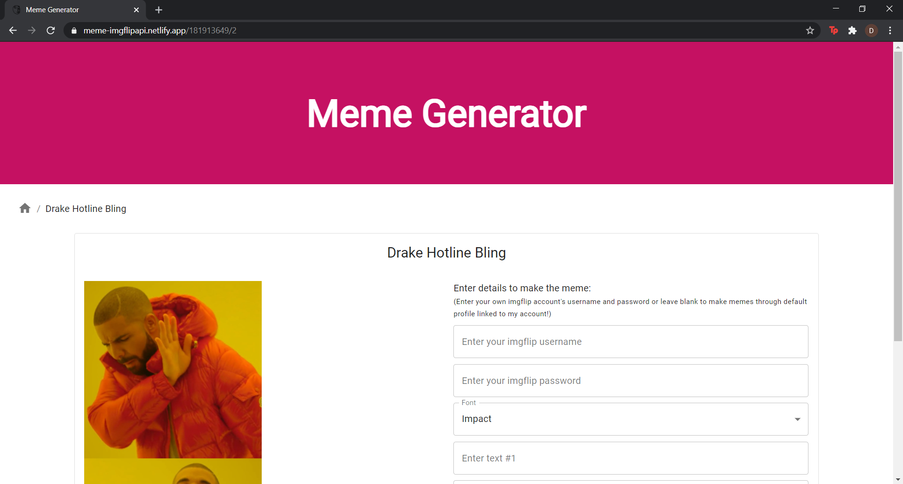

# Meme Generator

**React project** scaffolded out using 'npx create-react-app', made during my learning period as Frontend Mentee at DJ Unicode.

Try it out live at - <https://meme-imgflipapi.netlify.app/>

***

## Features inculcated in the project:

- **React Hooks** were used along with **React Router** for achieving an **SPA (Single Page Application)**, to dynamically load 2 different pages used in the project.
- **Axios** used for API fetching to make GET and POST request to **imgFlip API** (<https://imgflip.com/api>).
- **Material UI** for styling.
- New UI techniques applied were:
    - **Responsive View** - homepage utilises responsive grid and edit meme page has the form in responsive view.
    - **Pagination** - to shorten the length of the page and split different memes on 10 different conceptual pages.
    - **Lazy loading** - to lessen the client side loading of resources, npm module 'react-lazyload' is implemented.
    - **Breadcrumbs** - on the top of a meme edit page to navigate back to the homepage.
    - **Fade** - transitioning of the memes on homepage, in respect of the pagination used (one on top and one in bottom of the page).
- Deployed project using **Netlify** through continuous deployment from **GitHub** repository's main branch, while securely entering the environment variables.

***

## Page Routes:

- **Home Page: /** - homepage where all memes are fetched using the GET request on <https://api.imgflip.com/get_memes>
- **Edit Meme Page: /:id/:text_boxes** - dynamically rendered url for any meme to be created. text_boxes param is used to dynamically render the number of text fields required for a particular meme. On submission of the form POST request on <https://api.imgflip.com/caption_image> returns the meme desired with the changes applied.

***

## Screenshots:

- ### Home Page
    

- ### Edit Meme Page
    

- ### Mobile Responsive View for Edit Meme
    

- ### Generated Meme Modal
    
